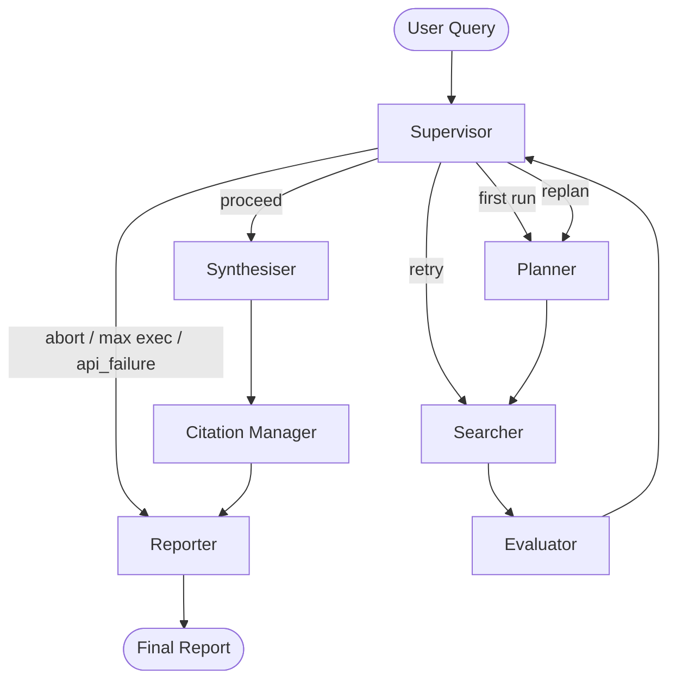

# 1. Architecture Diagram

The agent is implemented as a LangGraph `StateGraph` where each node operates on a shared `ResearchState`. The **Supervisor** acts as the central routing hub controlling execution flow.

---

## Node Responsibilities

| Node | Responsibility |
|------|---------------|
| Supervisor | Reads evaluation decision, sets next node, enforces execution limit, cost limit, and API failure termination |
| Planner | Decomposes query into ≤3 prioritised sub-questions using LLM |
| Searcher | Executes Tavily search → deduplication → scraping → builds citations |
| Evaluator | Scores results → computes confidence → decides retry/replan/proceed |
| Synthesiser | Builds context → generates claims with citations |
| Citation Manager | Validates citations and verifies claims against source chunks |
| Reporter | Maps citation IDs → generates final structured report |

---

# 2. State Schema

All nodes share a single `ResearchState` (Pydantic BaseModel).

---

## Input

| Field | Type | Description |
|------|------|------------|
| query | str | User research query |

---

## Planner

| Field | Type | Description |
|------|------|------------|
| research_plan | List[PlanStep] | Up to 3 prioritised sub-questions |

---

## Search

| Field | Type | Description |
|------|------|------------|
| search_results | Dict[int, List[SearchResult]] | Step-wise search results |

---

## Evaluation

| Field | Type | Description |
|------|------|------------|
| evaluation | Optional[EvaluationResult] | Evaluation output |
| failure_reason | str | Reason for failure |
| overall_confidence | float | Aggregate confidence score |

---

## Retry / Replan

| Field | Type | Description |
|------|------|------------|
| search_retry_count | int | Retry attempts |
| replan_count | int | Replan attempts |

---

## Execution

| Field | Type | Description |
|------|------|------------|
| node_execution_count | int | Total node executions |
| unresolved_steps | List[int] | Steps not resolved |

---

## Output

| Field | Type | Description |
|------|------|------------|
| synthesis | Optional[SynthesisModel] | Claims output |
| report | Optional[ReportModel] | Final report |

---

## Citations

| Field | Type | Description |
|------|------|------------|
| citations | Dict[str, Citation] | Citation registry |
| used_citation_ids | Set[str] | Referenced citations |
| citation_mapping | Dict[str, str] | Internal → output mapping |
| citation_chunks | Dict[str, List[str]] | Source chunks for verification |

---

## Control Flags

| Field | Type | Description |
|------|------|------------|
| is_partial | bool | Partial output flag |
| api_failure | bool | API failure trigger |
| abort | bool | Cost-based abort |

---

## Observability

| Field | Type | Description |
|------|------|------------|
| errors | List[ErrorLog] | Structured error logs |
| node_logs | Dict[str, Any] | Per-node logs |
| next_node | Optional[str] | Routing target |

---

## Cost Tracking

| Field | Type | Description |
|------|------|------------|
| total_tokens | int | Token usage |
| total_cost | float | Cost (INR) |
| cost_limit | float | Budget limit |

---

## Latency Tracking

| Field | Type | Description |
|------|------|------------|
| start_time | float | Start timestamp |
| elapsed_time | float | Execution duration |

---

# 3. Tool Integration

| Tool | Purpose | Output | Failure Handling |
|------|--------|--------|-----------------|
| call_llm | LLM completion | `{content, usage}` | Returns empty + error |
| search_tool | Tavily search | `List[SearchResult]` OR error dict | Structured error response |
| scrape_url | Extract content | `{content, publish_date}` | Fallback scraping |
| get_embedding | Text embedding | Vector | Returns None on failure |
| validate_url | URL validation | valid/stale/broken | Handles HTTP errors |
| get_dynamic_weights | LLM weight generation | scoring weights | fallback defaults |

---

# 4. Citation Design

## Citation Model

- Central registry: `state.citations`
- Each citation has:
  - quality_score
  - validation status

---

## Claim Verification

A citation is considered hallucinated if:

- No chunks available  
- URL invalid  
- similarity score ≤ 0.4  

A claim is marked **unverified** if:

- no valid citations  
- OR average similarity ≤ 0.5  

---

## Design Approach

- Multi-stage filtering:
  1. Search filtering  
  2. Synthesis selection  
  3. Citation verification  

- Reporter only uses **verified citations**

---

# 5. Known Limitations

- No persistent memory across runs  
- Sequential execution (no parallelism)  
- LLM-dependent conflict detection  
- Embedding model loads at startup  
- No fallback LLM provider  

---

# 6. Cost

| Metric | Value |
|------|------|
| Avg tokens | ~7400 |
| Avg cost | ~₹0.13 |
| Max budget | ₹2.0 |

Worst case (retry + replan): ~₹0.22

---

# 7. Key Challenges

## 1. Replanning Loop Prevention
- MAX_RETRIES = 1  
- MAX_REPLANS = 1  
- Execution limit = 12  

Prevents infinite loops.

---

## 2. Citation Quality Control
- 3-stage filtering pipeline  
- Only verified citations appear in output  

---

## 3. Contradictory Sources
- Conflicts preserved, not resolved  
- Multiple citations allowed per claim  

---

## 4. Stateless System Handling
- Deduplication handled during search  
- Step-based tracking prevents redundancy  

---

## 5. Cost vs Quality Tradeoff
- Cost limit enforced per run  
- Partial output generated when limits hit  