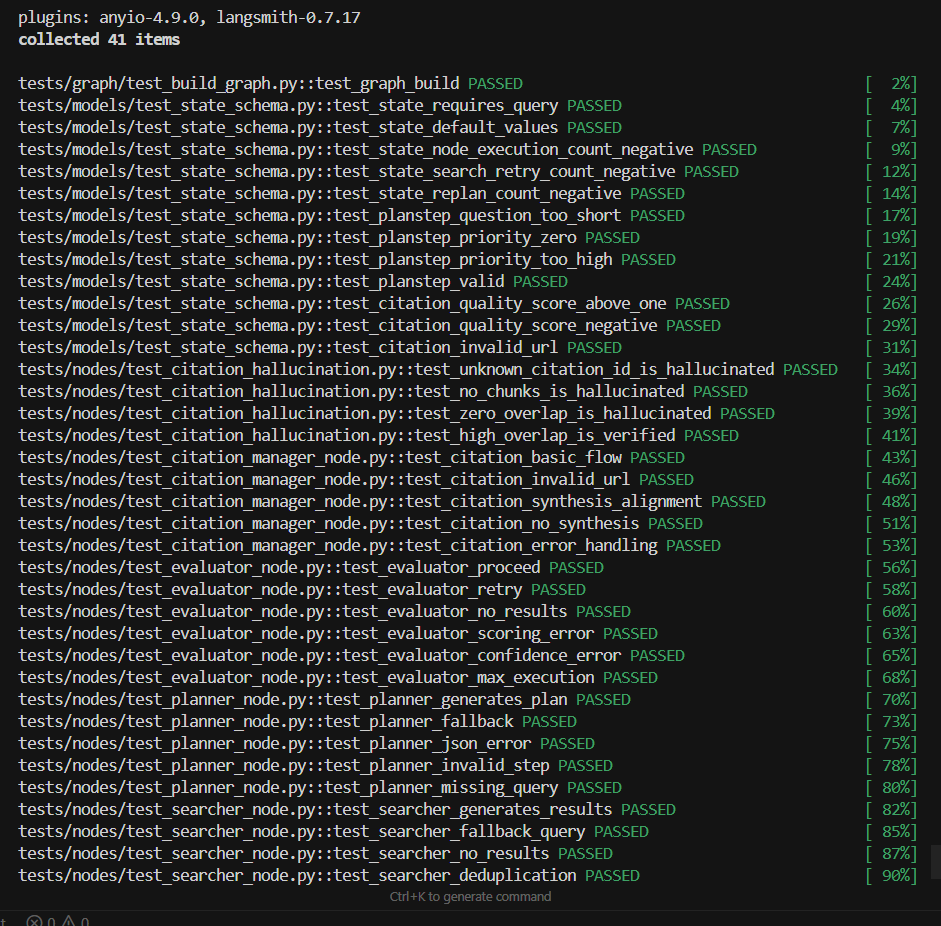
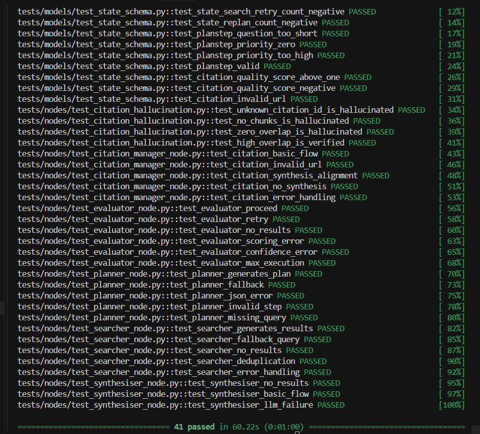

# Autonomous Research Agent

An autonomous multi-node AI research pipeline built with LangGraph. Given a natural language query, the agent plans sub-questions, searches the web, evaluates result quality, synthesises claims with citations, verifies them against source content, and produces a structured research report.

---

## Tech Stack

| Component        | Technology |
|-----------------|-----------|
| LLM             | OpenAI GPT-4o-mini (`openai==2.29.0`) |
| Orchestration   | LangGraph (`langgraph==1.1.3`) |
| Web Search      | Tavily (`tavily-python`) |
| Embeddings      | `sentence-transformers` — `all-MiniLM-L6-v2` |
| Web Scraping    | `trafilatura`, `beautifulsoup4`, `requests` |
| UI              | Streamlit (`streamlit==1.35.0`) |
| Observability   | LangSmith (`langsmith==0.7.22`) |
| Data Models     | Pydantic (`pydantic==2.12.5`) |

---

## Setup

### 1. Clone the repository

```bash
git clone https://github.com/lasya-ganji/autonomous-research-agent.git
cd autonomous-research-agent
```

---

### 2. Create and activate a virtual environment

```bash
python -m venv venv
```

#### Windows (PowerShell)

```bash
venv\Scripts\activate
```

#### macOS / Linux

```bash
source venv/bin/activate
```

---

### 3. Install dependencies

```bash
pip install -r requirements.txt
```

---

### 4. Configure environment variables

```bash
cp .env.example .env
```

Edit `.env` and add:

```
OPENAI_API_KEY=
TAVILY_API_KEY=
```

Optional (LangSmith tracing):

```
LANGCHAIN_API_KEY=
LANGCHAIN_TRACING_V2=true
LANGCHAIN_PROJECT=autonomous-research-agent
LANGCHAIN_ENDPOINT=https://api.smith.langchain.com
```

---

## How to Run

### Option 1: Streamlit UI

```bash
python -m streamlit run app/streamlit_app.py
```

Open http://localhost:8501

Tabs:
- **Report** — Final output  
- **Plan** — Generated sub-questions  
- **Search** — Retrieved sources  
- **Evaluation** — Confidence and decisions  
- **Synthesis** — Claims with citations  
- **Citations** — Source list  
- **Debug** — Logs, tokens, cost  

---

### Option 2: Command Line

```bash
python app/main.py
```

Prompts for a research query in the terminal and prints the final report.

---

## Testing

All tests use mocked dependencies — no real API calls required.

### Run all tests

```bash
pytest tests/
```

---

### Run specific node tests

```bash
pytest tests/nodes/test_planner_node.py
pytest tests/nodes/test_searcher_node.py
pytest tests/nodes/test_evaluator_node.py
pytest tests/nodes/test_synthesiser_node.py
pytest tests/nodes/test_citation_manager_node.py
```

---

### Useful flags

```bash
pytest tests/ -v
pytest tests/ -s
pytest tests/ -v -s
```

---

## Test Coverage

| Module                  | Tests | Coverage |
|------------------------|------|----------|
| Planner                | 5    | Plan generation, fallback, invalid JSON, validation |
| Searcher               | 5    | Results, fallback query, deduplication, error handling |
| Evaluator              | 6    | Decision logic, confidence, failure handling |
| Synthesiser            | 3    | Empty state, valid synthesis, fallback handling |
| Citation Manager       | 5    | Validation, URL handling, claim alignment |
| Citation Hallucination | 4    | Invalid IDs, no chunks, low similarity |
| State Schema           | 12   | Validation, constraints, error cases |
| Graph Build            | 1    | Graph compiles successfully |

**Total: 41 tests across 8 files**

### pytest output




---

## Notes

- All nodes are independently testable  
- System includes full error tracking and observability  
- Produces grounded outputs with verified citations  